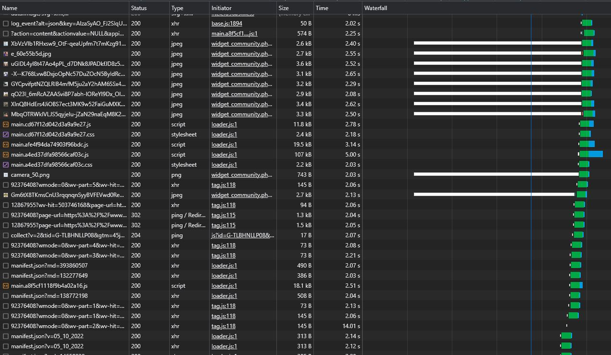

# Домашняя работа
Для связи насчет проверки домашней работы - тг @ktoSts

## Network
**1. На вкладке Network**
* [Записать и сохранить в HAR архив профиль загрузки ресурсов при открытии страницы](./main/1/main.har)
### Найти неоптимальные места
1) Различные дубликаты ресурсов
   
   
   
   |Шрифты, код на js загружаются по нескольку раз. Также 2 файла code.js с одинаковым кодом(см. HAR профиль).
   user-recognition отправляет несколько POST запросов с ответом 200 и еще 2 OPTION запроса с ответом 204(см. HAR профиль).
2) Лишний размер ресурса. Файлы с лишними комментариями/большими отступами.
   imageLeft_1628667062.5843.jpg и imageRight_1628667062.7146.jpg
   одна и та же картинка, просто отзеркалено (см. HAR профиль).
   
   
   
   
   На иконках используются не сжатые спрайты пнг(файл linkTo__sprite.png см. HAR профиль).
   Немало файлов без минификации, с ненужными комментариями и лишними отступами.
3) Медленно загружающиеся ресурсы
   
4) Ресурсы, блокирующие загрузку
   
   
5) Что-то ещё (ресурсы которые упали с ошибкой)
   
   Также много ответов со статусом 302, которые приводят к лишним запросам(см. HAR профиль).
### На вкладке Performance
1) [Записать и сохранить в файл профиль загрузки страницы](./main/2/main.json)
2) Измерить время в миллисекундах от начала навигации до событий First Paint (FP), First Contentful Paint (FCP), Largest Contentful Paint (LCP), DOM Content Loaded (DCL), Load
   
   
   
   
3) Определить, на каком DOM-элементе происходит LCP
   
4) Измерить, сколько времени в миллисекундах тратится на разные этапы обработки документа (Loading, Scripting, Rendering, Painting)
   
### На вкладке Coverage
1) Cохранить скриншот вкладки после загрузки страницы
   
2) Измерить в килобайтах объём неиспользованного CSS в ходе загрузки страницы(565kB)
   
3) Измерить в килобайтах объём неиспользованного JS в ходе загрузки страницы(2.3MB)
   

## Дополнительное задание Slow 3G и CPU 4x slowdown
### Найти неоптимальные места
Slow частично совпадает с анализом неоптимальных мест в нормальном режиме
1) [Записать и сохранить в HAR архив профиль загрузки ресурсов при открытии страницы](./slow_3G/1/optionally.har)
2) Медленно загружающиеся ресурсы и блокирующие
   
   
### На вкладке Performance
1) [Записать и сохранить в файл профиль загрузки страницы(из-за ограничений на размер файлов профиль на гугл диске)]( https://drive.google.com/file/d/1fmkPtkNmAQ35TSDkeDCBfTLm0M-0ki__/view?usp=sharing )
2) Измерить время в миллисекундах от начала навигации до событий First Paint (FP), First Contentful Paint (FCP), Largest Contentful Paint (LCP), DOM Content Loaded (DCL), Load
      
      
      
      

3) Определить, на каком DOM-элементе происходит LCP - на том же элементе, что и в первом варианте

4) Измерить, сколько времени в миллисекундах тратится на разные этапы обработки документа (Loading, Scripting, Rendering, Painting)
   

### На вкладке Coverage
1) Cохранить скриншот вкладки после загрузки страницы
   
2) Измерить в килобайтах объём неиспользованного CSS в ходе загрузки страницы
   
3) Измерить в килобайтах объём неиспользованного JS в ходе загрузки страницы
   